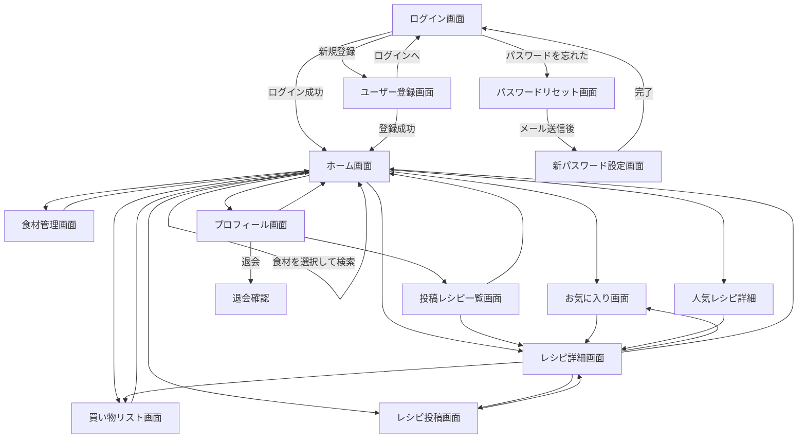

# レシピアプリ 仕様書（v2）

> 本ドキュメントは初期案（v1）に対し、PMレビューで洗い出した不足項目を協議のうえ確定し、反映したものです。
> 変更箇所には 🆕（新規追加）/ ✅（今回確定）を付記しています。

---

## 1. アプリ概要

### 1.1 コンセプト

**家にある食材から、作りたい料理をすぐに見つけられるレシピアプリ**

### 1.2 アプリで解決する課題

ユーザーが新しい料理に挑戦したいと思っても、レシピを検索すると持っていない材料が含まれていることが多く、一つずつ材料を確認するのが面倒。その結果、結局いつも作っている料理を選んでしまうという課題を解決する。

### 1.3 コアとなる価値

- 所持している食材からレシピを検索できる
- 検索結果をページ遷移せず、その場で確認できる
- 「今作れるレシピ」を最優先で表示する
- 不足している材料の種類数によってレシピを分類する
- レシピ選びに必要な情報を一覧で比較できる
- 不足材料をそのまま買い物リストへ追加できる

---

## 2. ペルソナ設計

### 2.1 基本情報

- 年齢：24歳
- 職業：会社員
- 居住：一人暮らし

### 2.2 生活・行動

- 普段から料理をする
- 料理自体は嫌いではない
- いつも同じ料理を作ることが多い
- 新しい料理に挑戦したい気持ちはある
- レシピを探す際はスマートフォンを利用する

### 2.3 課題

- いつも同じ料理ばかりで飽きている
- 新しい料理に挑戦したいが、レシピを探すのが面倒
- レシピを見つけても、持っていない材料が含まれていることが多い
- レシピを一つずつ開いて材料を確認するのが面倒
- 結果として、簡単に作れるいつもの料理を選んでしまう

### 2.4 ユーザーが達成したいこと

- できるだけ時間をかけずに、自分が作りたい料理を見つけて、おいしい料理を完成させたい。

### 2.5 アプリが提供する価値

- 所持している食材から、今すぐ作れる料理や、少し買い足せば作れる料理をすぐに見つけられるようにする。

---

## 3. 主要機能

### 3.1 ユーザー

- ユーザー登録
- ログイン・ログアウト
- 認可
- パスワードリセット（メールリンク方式）🆕
- 退会・アカウント削除 🆕

### 3.2 プロフィール 🆕

- プロフィール編集（名前・メールアドレス・パスワード変更・アイコン画像）
- ※活動実績（投稿数・お気に入り数等）の表示はMVPでは対象外（将来対応、12章参照）

### 3.3 食材

- 食材管理
- 所持食材の登録（**食材マスタからの選択のみ**）✅
- 所持食材の削除
- 所持食材の検索・選択

### 3.4 レシピ

- レシピ管理
- レシピ検索
- 所持食材からのレシピ検索
- 不足材料の判定
- レシピ詳細表示
- レシピ投稿・編集・削除（ユーザー投稿／CGM） ✅🆕
- 投稿レシピ一覧表示（自分が投稿したレシピの確認） 🆕
- お気に入り登録・解除
- レシピランキング（お気に入り数ベース、全期間累計） ✅
- レビュー・コメント機能

### 3.5 買い物

- 買い物リスト
- 買い物リストへの追加・削除
- 購入済み管理
- レシピから不足材料を買い物リストへ追加

### 3.6 余裕があれば

- 食材の数量管理
- 高度なレシピ推薦（ユーザーの好みを推測）
- ランキングの複合スコア化（お気に入り数＋評価） ✅
- ランキング集計期間の直近化（全期間→直近1週間／1ヶ月など） ✅
- プロフィールでの活動実績表示 ✅
- レシピ投稿への通報機能 ✅
- 食材の自由入力＋表記ゆれ吸収（正規化） ✅
- 食材マスタ追加リクエスト機能

---

## 4. ユーザーフロー

### 4.1 メインフロー

```text
アプリを開く
    ↓
ログイン
    ↓
ホーム画面
    ↓
所持食材を選択・入力（マスタから選択）
    ↓
検索
    ↓
検索結果を同一画面内に表示
  （0件の場合：食材追加導線＋人気レシピ代替表示）🆕
    ↓
レシピを比較
    ↓
作りたいレシピを選択
    ↓
レシピ詳細
    ↓
必要な材料・調理手順を確認
    ↓
料理する
```

### 4.2 不足材料がある場合

```text
レシピ詳細
    ↓
不足材料を確認
    ↓
不足材料を買い物リストへ追加
    ↓
買い物
    ↓
料理する
```

### 4.3 お気に入りから探す場合

```text
ホーム
    ↓
お気に入り
    ↓
お気に入りレシピを選択
    ↓
レシピ詳細
```

### 4.4 人気レシピから探す場合

```text
ホーム
    ↓
人気レシピランキング
    ↓
気になるレシピを選択
    ↓
レシピ詳細
```

### 4.5 レシピを投稿する場合 🆕

```text
ホーム or レシピ詳細
    ↓
レシピ投稿画面
    ↓
料理画像・レシピ名・材料（マスタから選択）・調理手順・調理時間を入力
    ↓
投稿（即時公開）
    ↓
レシピ詳細画面へ遷移
```

### 4.6 パスワードを忘れた場合 🆕

```text
ログイン画面
    ↓
「パスワードをお忘れの方はこちら」
    ↓
メールアドレス入力画面
    ↓
リセットメール送信
    ↓
メール内リンクから新パスワード設定画面へ
    ↓
パスワード再設定完了
    ↓
ログイン画面
```

---

## 5. 検索機能の仕様

### 5.1 検索方法

ユーザーは所持している食材を複数選択してレシピを検索する。

検索画面では、あらかじめ食材管理画面で登録した所持食材を選択できるようにする。

食材の選択肢は **食材マスタに登録されているものに限定する**（自由入力は将来対応、3.6節参照）。✅

### 5.2 検索結果の表示方法

検索ボタンを押した後、**ページ遷移せず、同一画面の下部に検索結果を表示する。**

### 5.3 レシピの分類・表示順

検索した食材を基準に、レシピに不足している材料の種類数によって分類する。

```text
① 今作れるレシピ
   不足材料：0種類

② 材料が1種類足りないレシピ
   不足材料：1種類

③ 材料が複数足りないレシピ
   不足材料：2種類以上
```

②③のカテゴリ内では、不足材料の種類数が少ない順（昇順）にレシピを並べる。🆕✅

### 5.4 不足材料の判定ルール

- **材料の種類数で判定する**
- レシピに必要な材料のうち、ユーザーが所持していない材料の種類数を不足数とする
- 材料の数量は判定に使用しない
- 「鶏肉が300g必要だが100gしかない」といった量の不足は考慮しない
- 「鶏肉を所持している」かどうかのみで判定する
- 食材マスタを介した判定のため、表記ゆれによる誤判定は原則発生しない ✅

### 5.5 例

レシピ：親子丼

- 鶏肉：所持
- 卵：所持
- 玉ねぎ：所持
- 醤油：所持
- みりん：未所持

→ 不足材料は **1種類**

そのため「材料が1種類足りないレシピ」に表示する。

### 5.6 検索結果が0件の場合 ✅🆕

すべての分類（①〜③）で該当レシピが1件もない場合、以下を組み合わせて表示する。

- 「該当するレシピが見つかりませんでした」等のメッセージ
- 食材管理画面への導線（「食材を追加してみましょう」等）
- 人気レシピランキング上位の代替表示（「こちらもおすすめです」等）

---

## 6. レシピカードの要件

検索結果やランキングで表示するレシピカードには、以下を表示する。

- 料理画像
- レシピ名
- 材料
- 調理時間
- 評価

不足材料がある場合は、あわせて不足材料を表示する。

### 表示例

```text
┌──────────────────────┐
│       料理画像         │
│ 鶏肉の照り焼き         │
│ 材料：鶏肉・醤油・みりん │
│ 調理時間：20分          │
│ 評価：★★★★☆ 4.5       │
└──────────────────────┘
```

---

## 7. 各画面の要件

### 7.1 ログイン画面

#### 目的

ユーザーを認証し、アプリを利用できる状態にする。

#### 表示項目

- メールアドレス
- パスワード
- ログインボタン
- ユーザー登録画面へのリンク
- 「パスワードをお忘れの方はこちら」リンク 🆕

#### 要件

- 未入力時のバリデーションエラーを表示する
- メールアドレス形式をチェックする
- 認証失敗時にエラーメッセージを表示する
- ログイン成功後、ホーム画面へ遷移する
- ログイン済みユーザーがアクセスした場合はホーム画面へリダイレクトする

---

### 7.2 ユーザー登録画面

#### 目的

新規ユーザーがアカウントを作成する。

#### 表示項目

- 名前
- メールアドレス
- パスワード
- パスワード確認
- 登録ボタン
- ログイン画面へのリンク

#### 要件

- 入力値をバリデーションする
- メールアドレスの重複をチェックする
- パスワード確認を行う
- 登録成功後、ログイン状態にしてホーム画面へ遷移する

---

### 7.3 パスワードリセット画面 🆕

#### 目的

パスワードを忘れたユーザーが、メール経由で安全に再設定できるようにする。

#### 画面構成

1. **メールアドレス入力画面**：登録済みメールアドレスを入力し、リセットリンクを送信する
2. **新パスワード設定画面**：メール内リンクから遷移し、新しいパスワードを設定する

#### 要件

- メールアドレスが未登録の場合も送信結果の表示は同一にする（登録有無の推測を防ぐ）
- リセットリンクには有効期限を設ける
- 再設定完了後、ログイン画面へ遷移する

---

### 7.4 ホーム画面 ★最重要

#### 目的

ユーザーができるだけ少ない操作で、作りたい料理を見つけられるようにする。

#### 主な要素

- 食材検索エリア
- 検索結果
- 人気レシピランキング
- 共通ナビゲーション

#### 食材検索エリア

- 所持食材を複数選択できる（食材マスタから選択） ✅
- 選択した食材を表示する
- 選択した食材を削除できる
- 食材を追加できる
- 検索ボタンを押せる
- 検索後も同一画面に留まる

#### 検索結果

以下の順番で表示する。

1. 今作れるレシピ
2. 材料が1種類足りないレシピ
3. 材料が複数足りないレシピ（**不足材料数が少ない順（昇順）に表示**）🆕✅

0件の場合の挙動は5.6節を参照。✅

#### ページング方式 🆕

- 各カテゴリ（今作れる／1種類不足／複数不足）ごとに、初期表示は20件までとする
- 各カテゴリの末尾に「もっと見る」ボタンを表示し、押下すると次の20件を追加で読み込んで表示する（無限スクロールは採用しない）
- APIはカーソルベースのページングとし、1回のリクエストにつき20件を返す
- カテゴリごとに独立して「もっと見る」を扱う（例：①は全件表示済みだが③はまだ続きがある、という状態を許容する）

#### 人気レシピランキング

- ホーム画面上に人気レシピを表示する
- 集計基準：お気に入り数（MVP）、全期間累計（MVP） ✅
  - 将来：評価との複合スコア化、直近期間集計への切り替えを検討（3.6節）
- ランキング項目をクリックするとレシピ詳細へ遷移する
- 上位数件を表示し、将来的にもっと見る機能へ拡張できる構成にする

---

### 7.5 レシピ詳細画面 ★重要

#### 目的

レシピを選んだユーザーが、必要な情報を確認して「これを作ろう」と判断できるようにする。

#### 表示項目

- 料理画像
- レシピ名
- 評価
- 調理時間
- 材料一覧
- 調理手順
- お気に入りボタン
- 不足材料
- 買い物リスト追加ボタン
- 投稿者名／編集・削除ボタン（投稿者本人のみ表示） 🆕
- レビュー投稿欄（星評価＋コメント） 🆕

#### 材料の所持状況

ユーザーの所持食材と比較し、各材料の所持状況を表示する。

```text
材料

✓ 鶏肉
✓ 卵
✓ 玉ねぎ
× みりん
```

#### 要件

- 所持食材とレシピ材料を比較する
- 不足材料を明示する
- 不足材料だけを買い物リストへ追加できる
- お気に入り登録・解除ができる
- 調理手順を順番に確認できる
- 投稿者本人は編集・削除ができる 🆕
- 星評価（1〜5段階）とコメントを入力してレビューを投稿できる 🆕

---

### 7.6 レシピ投稿画面 🆕

#### 目的

ユーザーが自身のレシピを投稿し、コミュニティ全体のレシピ資産を増やせるようにする。

#### 表示項目

- 料理画像アップロード
- レシピ名
- 材料（**食材マスタから選択**、レシピ詳細と同じ粒度）
- 調理手順
- 調理時間
- 投稿ボタン

#### 要件

- 材料は自由入力ではなく食材マスタから選択させ、判定精度を担保する ✅
- 投稿後は**即時公開**する（承認フローなし） ✅
- 投稿者本人は投稿後も**自由に編集・削除**できる ✅
- 不適切投稿への**通報機能はMVP対象外**（将来対応、3.6節） ✅
  - 補足：MVPは信頼できる範囲での試験運用を想定し、モデレーション機能なしで先行する

---

### 7.7 食材管理画面

#### 目的

ユーザーが現在所持している食材を管理する。

#### 表示内容

- 所持食材一覧
- 食材追加（**食材マスタからの選択のみ**） ✅
- 食材削除
- 食材検索

#### 要件

- 食材マスタから選択して登録できる ✅
- 食材を削除できる
- 食材を検索できる
- 登録済み食材を一覧表示できる
- 所持量は管理しない
- 消費期限は管理しない
- マスタに存在しない食材の登録は、MVPでは不可（将来対応：自由入力＋正規化、3.6節） ✅
- 買い物リストで購入済みにした食材は、自動的に所持食材一覧へ追加される（7.9節参照） ✅🆕

---

### 7.8 お気に入り画面

#### 目的

気に入ったレシピを後から簡単に見つけられるようにする。

#### 表示内容

お気に入り登録したレシピをカード形式で表示する。

カードには以下を表示する。

- 料理画像
- レシピ名
- 調理時間
- 評価

#### 要件

- お気に入り登録・解除ができる
- お気に入りレシピを一覧表示できる
- レシピ詳細へ遷移できる

---

### 7.9 買い物リスト画面

#### 目的

料理に必要な不足材料を管理する。

#### 表示内容

```text
買い物リスト

□ みりん
□ じゃがいも
□ チーズ
□ 玉ねぎ
```

#### 要件

- 食材を追加できる
- 食材を削除できる
- 購入済みに変更できる
- 未購入・購入済みを区別できる
- レシピ詳細から不足材料を追加できる

#### UX上のポイント

レシピ詳細画面で不足材料を確認した後、手入力することなく買い物リストへ追加できるようにする。

#### 重複処理・所持食材との連携 ✅🆕

- 複数レシピ由来で同一食材が重複した場合、買い物リスト上では**1件に統合**する（レシピごとの個別追加はしない）
- 購入済みにチェックした食材は、**所持食材へ自動反映**する（食材管理画面の所持食材一覧に自動追加され、手動での再登録は不要）

---

### 7.10 プロフィール画面 🆕

#### 目的

ユーザーが自身のアカウント情報を確認・編集できるようにする。

#### 表示・編集項目

- 名前
- メールアドレス
- パスワード変更
- アイコン画像

#### 要件

- 上記項目を編集・保存できる
- 活動実績（投稿レシピ数、お気に入り数等）の表示はMVP対象外 ✅
- 投稿したレシピの一覧（7.12節）への導線を設置する 🆕
- 退会（アカウント削除）への導線を設置する 🆕

---

### 7.11 退会・アカウント削除 🆕

#### 目的

ユーザーが自身の意思でアカウントを削除できるようにする。

#### 挙動

- ユーザーの個人情報（名前・メールアドレス・パスワード等）を削除する
- ユーザーが投稿したレシピ・レビュー等は**匿名化して残存**させる（例：投稿者表示を「削除済みユーザー」とする） ✅
- お気に入り・買い物リスト等、ユーザー個人に紐づくデータは削除する

#### 要件

- 退会前に確認ダイアログを表示する
- 退会後はログイン不可とする

---

### 7.12 投稿レシピ一覧画面 🆕

#### 目的

投稿者本人が、自分が投稿したレシピを一元的に確認し、編集・削除画面へ迷わず辿り着けるようにする。

#### 背景

MVPでは投稿済みレシピへの導線がホーム画面の検索結果・ランキング・お気に入り一覧経由に限られており、
投稿者本人であっても自分の投稿を横断的に見返す手段がなかった。この課題に対応するため新設する。

#### 表示内容

投稿したレシピをカード形式で一覧表示する。カードには以下を表示する。

- 料理画像
- レシピ名
- 調理時間
- 評価

#### 要件

- 自分が投稿したレシピのみを一覧表示する（投稿日時の新しい順）
- レシピを選択するとレシピ詳細画面へ遷移する
- レシピ詳細画面から編集・削除ができる（7.5節参照）
- 投稿が0件の場合は「まだ投稿したレシピがありません」等のメッセージとレシピ投稿画面への導線を表示する
- プロフィール画面（7.10節）からの導線を設置する

---

## 8. 画面遷移図

### 8.1 全体



### 8.2 補足

- ホーム画面でのレシピ検索は**ページ遷移しない**。
- 食材を選択して検索すると、ホーム画面下部に検索結果が表示される。検索結果が0件の場合は食材追加導線と人気レシピを表示する（5.6節）。✅
- 検索結果からレシピを選択するとレシピ詳細へ遷移する。
- 人気レシピランキングもホーム画面内に配置し、選択したレシピはレシピ詳細へ遷移する。
- レシピ詳細からお気に入り登録・解除ができる。
- レシピ詳細から不足材料を買い物リストへ追加できる。
- レシピ詳細から投稿済みレシピの編集画面（レシピ投稿画面を流用）へ遷移できる。 🆕
- ログイン画面からパスワードリセットフローへ遷移できる。 🆕
- プロフィール画面から退会フローへ遷移できる。 🆕
- プロフィール画面から投稿レシピ一覧画面へ遷移し、投稿したレシピを選択するとレシピ詳細へ遷移できる。 🆕

### 8.3 ナビゲーションイメージ

```text
                    ┌─────────────┐
                    │   ホーム     │
                    │ レシピ検索   │
                    │ 人気ランキング│
                    └──────┬──────┘
                           │
    ┌──────────┬──────┬───┼───┬──────────┬──────────┐
    ↓          ↓      ↓   ↓   ↓          ↓          ↓
 食材管理    お気に入り レシピ詳細 レシピ投稿 買い物リスト プロフィール ログアウト
                ↑      │        ↑
                └──────┴────────┘
```

---

## 9. 共通UI・ナビゲーション

### 9.1 主なナビゲーション

- ホーム
- 食材管理
- お気に入り
- 買い物リスト

### 9.2 アカウント関連

- プロフィール（編集画面あり、7.10節参照） ✅
- 投稿レシピ一覧（7.12節参照） 🆕
- ログアウト
- 退会 🆕

### 9.3 レスポンシブ対応

スマートフォンからの利用を想定する。

スマートフォンでは下部ナビゲーションを採用する案を検討する。

---

## 10. データ判定に関する重要仕様

### 10.1 所持食材判定

レシピの各材料について、ユーザーの所持食材一覧に同じ種類の食材が存在するかで判定する。

食材はマスタ経由で登録されるため、名寄せ（表記ゆれの吸収）は原則不要となる。✅

### 10.2 不足数

```text
不足数 = レシピに必要な材料のうち、ユーザーが所持していない材料の種類数
```

### 10.3 判定例

```text
レシピA
必要材料：鶏肉、卵、玉ねぎ
所持材料：鶏肉、卵、玉ねぎ
不足：0種類
→ 今作れるレシピ

レシピB
必要材料：鶏肉、卵、玉ねぎ、みりん
所持材料：鶏肉、卵、玉ねぎ
不足：1種類
→ 材料が1種類足りないレシピ

レシピC
必要材料：鶏肉、卵、玉ねぎ、みりん、砂糖、だし
所持材料：鶏肉、卵、玉ねぎ
不足：3種類
→ 材料が複数足りないレシピ
```

### 10.4 トランザクション方針 🆕

複数テーブルにまたがる更新のうち、途中で失敗すると整合性が崩れる処理については、
DBトランザクション（Laravelの `DB::transaction()`）で1つの原子的な操作として扱う。

#### 10.4.1 トランザクション境界が必要な処理

| 処理 | 対象UC | 更新対象テーブル | 理由 |
|---|---|---|---|
| 購入済みへの変更 | UC-08-05 | `shopping_list_items`（ステータス更新）、`user_ingredients`（所持食材への追加） | 片方のみ成功すると「購入済みなのに所持食材にない」状態が発生するため |
| 不足材料の買い物リスト一括追加 | UC-08-01 | `shopping_list_items`（複数件のinsert、既存食材との統合判定） | 一部の食材だけ追加された中途半端な状態を避けるため |
| 重複食材の統合 | UC-08-06 | `shopping_list_items` | 統合処理中に一部の行だけ更新される状態を避けるため |
| レシピ削除 | UC-06-03 | `recipes`、`recipe_ingredient`、`favorites`、`reviews` 等の関連データ | 親レシピのみ削除され孤児データ（お気に入り・レビュー等）が残ることを避けるため |
| 退会・アカウント削除 | UC-01-06 | `users`（削除）、`recipes`（投稿者の匿名化）、`favorites`／`shopping_list_items`等の個人データ（削除） | 一部だけ処理されて個人情報が残存する状態を避けるため（7.11節参照） |
| レシピ投稿 | UC-06-01 | `recipes`、`recipe_ingredient` | レシピ本体のみ登録され材料が空の不完全なレシピが公開されることを避けるため |

#### 10.4.2 方針

- 上記処理は必ずDBトランザクション内で実行し、途中でエラーが発生した場合は全体をロールバックする
- トランザクション内では外部APIコール（画像アップロード等）を行わない。画像アップロード等の外部I/Oはトランザクションの前後で実施し、DB更新のみを原子的に扱う
- 上記以外の単純な単一テーブル・単一レコードの更新（例：所持食材の削除、お気に入りの登録・解除）はトランザクション必須としない
- 具体的な実装方針・ロック戦略（悲観ロック／楽観ロック等）は詳細設計時に確定する（12.3節参照）

---

## 11. 主要UXの考え方

### 11.1 基本方針

ユーザーに大量のレシピを検索・確認させるのではなく、**「今の自分の状況で作れそうなレシピ」を先に提示する。**

### 11.2 情報の優先順位

```text
今作れるかどうか
        ↓
不足材料はいくつか
        ↓
材料
        ↓
調理時間
        ↓
評価
```

### 11.3 検索画面の基本思想

- ページ遷移を減らす
- 検索結果をその場で確認できるようにする
- レシピを開かなくても比較できるようにする
- 不足材料を事前に把握できるようにする

---

## 12. 今後検討する事項（将来対応）

MVPでは対応しないが、拡張フェーズで検討する事項。

### 12.1 食材・レシピデータ関連

- 食材の自由入力対応、および表記ゆれの正規化（エイリアス管理） ✅
- 食材マスタへの追加リクエスト機能
- 食材マスタの初期データ整備方法（外部APIからの抽出 or 手動作成）
- レシピデータの外部API取り込み時の食材マスタへのマッピング運用ルール ✅

### 12.2 レシピ・コミュニティ関連

- レシピ投稿への通報・モデレーション機能 ✅
- ランキングの複合スコア化（お気に入り数＋評価） ✅
- ランキング集計期間の直近化（全期間→直近1週間／1ヶ月等） ✅
- プロフィールでの活動実績表示（投稿数・お気に入り数等） ✅

### 12.3 その他

- レシピ詳細で材料をどの粒度で表示するか
- スマートフォンとPCそれぞれのナビゲーション設計
- 二段階認証等、認証方式の高度化
- API設計
- DB設計
- パフォーマンス目標、個人情報保護方針等の詳細な非機能要件

---

### 12.4 非機能要件（MVP方針） ✅🆕

| 項目 | 内容 |
|---|---|
| 認証方式 | セッション方式 |
| パスワードポリシー | 一般的な水準を採用（目安：8文字以上、英字・数字を含む 等） |
| 画像アップロード形式 | JPG・PNG |
| 画像アップロードサイズ上限 | 一般的な水準を採用（目安：1ファイルあたり5MB程度） |

具体的な数値・実装方式は、技術選定（Laravelのバリデーションルール、ストレージ構成等）と合わせて詳細化する。

---

## 13. 開発の次工程

```text
企画・課題定義
    ↓
ペルソナ設計
    ↓
主要機能定義
    ↓
ユーザーフロー
    ↓
画面一覧・画面要件
    ↓
画面遷移図
    ↓
ワイヤーフレーム
    ↓
UIデザイン（Figma）
    ↓
DB設計
    ↓
API設計
    ↓
技術構成の確定
    ↓
実装
    ↓
テスト
    ↓
改善
```

---

## 14. 技術構成案（暫定）

現時点では以下を候補とする。

- Frontend：React / TypeScript
- Backend：Laravel / PHP
- Database：PostgreSQL
- UI Design：Figma

画像アップロード（アイコン画像・レシピ画像）に対応するため、ストレージ（画像保存先）の構成検討も必要。🆕

※技術構成は今後の学習状況・求人市場・実装要件を踏まえて確定する。

---

## 15. 変更履歴

| バージョン | 日付 | 主な変更内容 |
|---|---|---|
| v1 | - | 初期案 |
| v2 | 2026-08-28 | 食材マスタ方針、レシピデータ調達方針、ランキング集計方法、レシピ投稿画面、検索0件時の挙動、プロフィール画面、パスワードリセット、退会機能、買い物リストの重複処理・自動反映、非機能要件（認証方式・パスワードポリシー・画像アップロード制約）を確定・反映 |
| v2.1 | 2026-08-31 | ユースケース一覧（use_cases.md）との整合性チェックにより判明した記載漏れを追記：①検索結果②③カテゴリ内の並び順（不足材料数の昇順）、②レシピ詳細画面へのレビュー投稿機能（星評価＋コメント）の要件を追加 |
| v2.2 | 2026-08-31 | 投稿者本人が自分の投稿レシピを一元的に確認できる導線がなかったため、「投稿レシピ一覧画面」（7.12節）を新設。プロフィール画面からの導線、画面遷移図、主要機能一覧、ナビゲーション一覧に反映 |
| v2.3 | 2026-08-31 | トランザクション方針について記載がなかったため、10.4節を新設。複数テーブルにまたがる更新（購入済み変更、買い物リスト統合、レシピ削除、退会処理、レシピ投稿）について原子性の担保方針を明記 |
| v2.4 | 2026-08-31 | ホーム画面の検索結果表示について、パフォーマンス面の検討を踏まえページング方式を確定。カテゴリごとに20件ずつ「もっと見る」ボタンで読み込む方式とし、7.4節に追記 |
| v2.5 | 2026-08-31 | ドキュメント整理：12.3節「買い物リスト関連（確定済み・参考記載）」を削除（7.9節と内容が完全重複していたため）。旧12.4節を12.3節に、旧12.5節を12.4節に繰り上げ、見出しレベルの不整合（`##`→`###`）も修正 |
